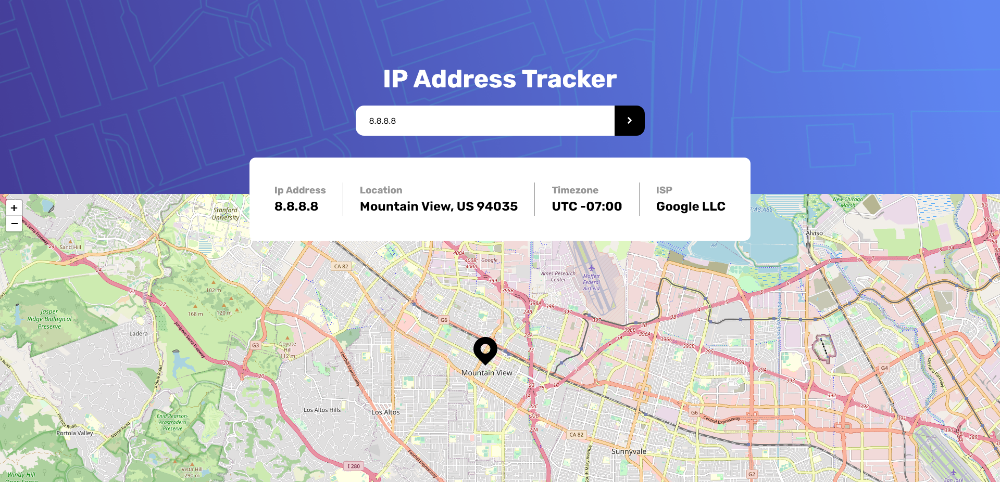

# Frontend Mentor - IP address tracker solution

This is a solution to the [IP address tracker challenge on Frontend Mentor](https://www.frontendmentor.io/challenges/ip-address-tracker-I8-0yYAH0). Frontend Mentor challenges help you improve your coding skills by building realistic projects.

## Table of contents

- [Overview](#overview)
  - [The challenge](#the-challenge)
  - [Screenshot](#screenshot)
  - [Links](#links)
- [My process](#my-process)
  - [Built with](#built-with)
  - [What I learned](#what-i-learned)
  - [Useful resources](#useful-resources)
- [Author](#author)

## Overview

### The challenge

Users should be able to:

- View the optimal layout for each page depending on their device's screen size
- See hover states for all interactive elements on the page
- See their own IP address on the map on the initial page load
- Search for any IP addresses or domains and see the key information and location

### Screenshot



### Links

- Solution URL: [IP Tracker](https://github.com/Jahan-Shah/ip-address-tracker)
- Live Site URL: [IP Tracker](https://iptrackerapp-fem.netlify.app/)

## My process

### Built with

- Semantic HTML5 markup
- CSS custom properties
- Flexbox
- Mobile-first workflow
- IPFY-API - [IPFY](https://www.ipify.org/)
- Leafletjs - [Leaflet](https://leafletjs.com/)

### What I learned

I learned Netlify serverless function to work with API calls without exposing it to the client side.

```js
import axios from "axios";

export async function handler(event) {
  const { input } = JSON.parse(event.body);
  const API = process.env.API_KEY;
  const url = `https://geo.ipify.org/api/v2/country,city?apiKey=${API}&ipAddress=${input}`;
  try {
    const response = await axios.get(url);
    const data = response.data;
    return {
      statusCode: 200,
      body: JSON.stringify(data),
    };
  } catch (err) {
    const { status, statusText, headers, data } = err.response;
    return {
      status,
      body: JSON.stringify({ status, statusText, headers, data }),
    };
  }
}
```

### Useful resources

- [IPFY](https://www.ipify.org/) - A Simple Public IP Address AP
- [Leaflet](https://leafletjs.com/) - Leaflet is the leading open-source JavaScript library for mobile-friendly interactive maps.

## Author

- Frontend Mentor - [@Jahan-Shah](https://www.frontendmentor.io/profile/Jahan-Shah)
- LinkedIn - [@jahan--shah](https://www.linkedin.com/in/jahan--shah/)
